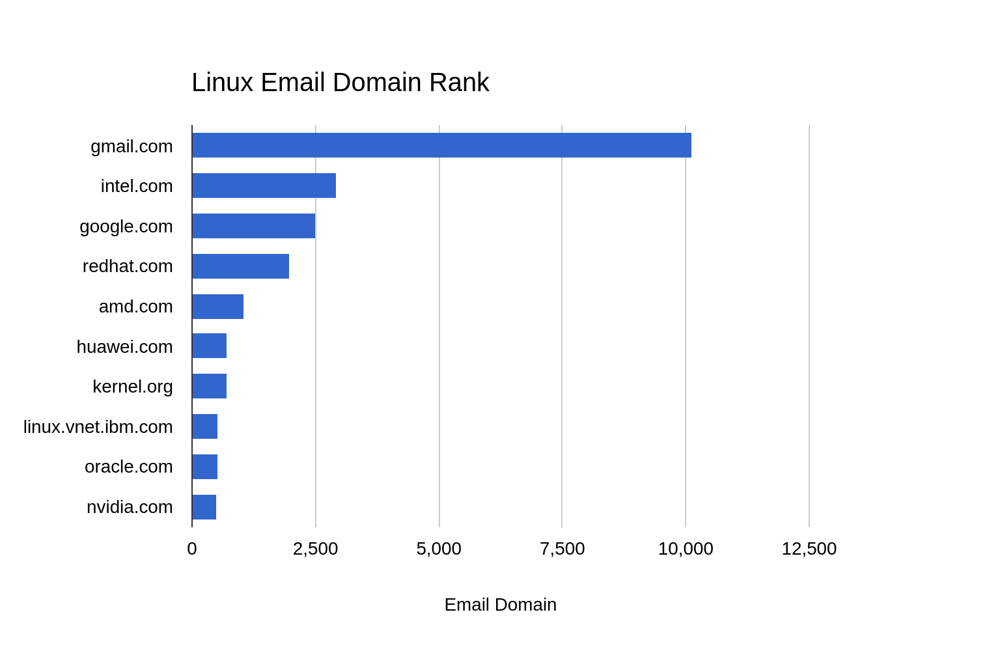

# linux_kernel_email_service_rank
Scripts to get most used email service in linux kernel commit

2023-11-17
Result:

| All emails | 59489 |
|----------|-------------|
| All domains | 12101 |

| Email domain   |   Count   |
|:----------|:-------------|
| gmail.com | 10122 |
| intel.com | 2933 |
| google.com | 2516 |
| redhat.com | 1972 |
| amd.com | 1050 |
| huawei.com | 717 |
| kernel.org | 700 |
| linux.vnet.ibm.com | 538 |
| oracle.com | 523 |
| nvidia.com | 499 |

